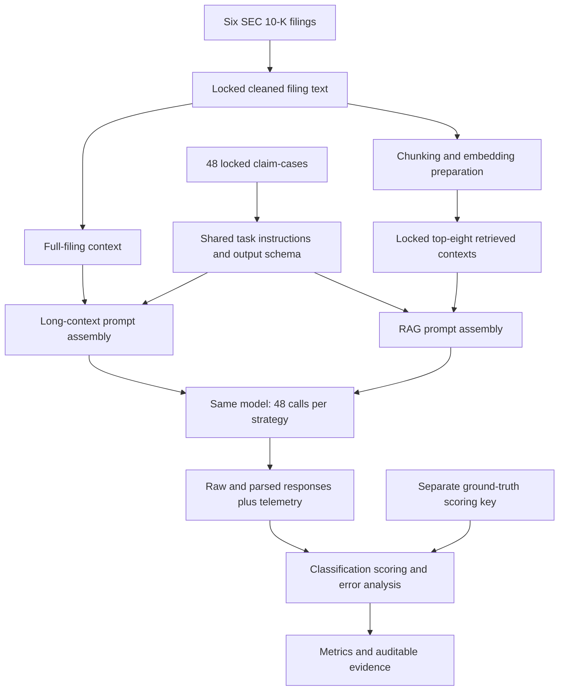

# Long-Context LLMs vs RAG for Financial Document Reasoning

**A controlled, same-model evaluation of evidence-grounded claim classification in SEC 10-K filings.**

**Harjinder Singh** · MSc Advanced Computer Science with Artificial Intelligence  
University of Strathclyde · Dissertation submitted August 2026

**Python · Docker · LLM Evaluation · Retrieval-Augmented Generation · Reproducible Research**

[Read the dissertation](docs/dissertation/Dissertation_Public_Copy.pdf) · [Inspect the results](evidence/main-run/) · [Reproduce the scoring](#reproduce-the-results-without-api-calls) · [Technical guide](docs/REPRODUCIBILITY.md)

---

## The question

**Does giving an LLM an entire financial filing improve its reasoning enough to justify the additional cost, compared with supplying retrieved evidence?**

This dissertation investigates cross-section inconsistency detection through claim classification: deciding whether a claim is **Supported**, **Contradicted**, or has **Insufficient Evidence** in a filing. Relevant information may be distributed across Business, Risk Factors, Management's Discussion and Analysis, financial statements and notes.

I designed and implemented a containerised experimental apparatus that compares **full-filing long-context prompting** with **retrieval-augmented prompting**, using the same model, claims, label definitions, output schema and scoring procedure. The independent variable is the method used to deliver filing context—not a change of model.

**Scope: six filings · 48 locked claim-cases · 96 completed evaluations · three balanced labels.**

This repository is a research and engineering portfolio, not a production financial-analysis service or an automated audit system.

## Main findings

On the locked main-run dataset, RAG classified **one additional case correctly** while using substantially fewer input tokens and lower estimated model-call cost.

| Main-run measure | Full-filing long context | RAG |
|---|---:|---:|
| Correct classifications | 41 / 48 | 42 / 48 |
| Accuracy | 85.42% | 87.50% |
| Macro F1 | 84.68% | 87.28% |
| Input tokens, all 48 calls | 8,582,196 | 443,289 |
| Output tokens, all 48 calls | 25,257 | 20,111 |
| Telemetry-estimated model-call cost, all 48 calls | $43.668690 | $2.819775 |
| Mean API-call latency | 10.36 s | 6.23 s |
| Median API-call latency | 9.19 s | 5.34 s |

Long context used **19.36× the input tokens** and **15.49× the estimated model-call cost** of RAG in this experiment. These are historical, token-derived model-call estimates—not provider invoices, current prices, or total RAG-system costs. Embedding/index preparation, engineering effort and infrastructure are not included in this comparison.

**Interpretation:** greater access to filing text did not guarantee better use of evidence. The accuracy difference is descriptive, amounts to one case, and is **not presented as statistically significant or as proof that RAG is generally superior**.

Sources: [dissertation, Chapter 5](docs/dissertation/Dissertation_Public_Copy.pdf#page=35), [condition metrics](evidence/main-run/condition_metrics.csv), [confusion matrix](evidence/main-run/confusion_matrix.csv), [per-call telemetry](evidence/main-run/main_run_telemetry.csv) and [derived analysis workbook](evidence/analysis/Main_Run_Results_Extraction_and_Analysis_Workbook_v1.xlsx). The figures above describe the **final main run**, not the pilot.

### The more important failure mode

Both strategies correctly identified all 16 ground-truth **Contradicted** cases, but they also produced false contradiction predictions. **Twelve of the 13 incorrect outputs** classified an **Insufficient Evidence** case as **Contradicted**. The remaining error classified a Supported case as Insufficient Evidence. **All 13 incorrect outputs reported High confidence.**

The engineering lesson is to evaluate evidence sufficiency and label boundaries—not only whether a relevant passage was retrieved or a large context window was available. Model-reported confidence was not a reliable error flag in this study.

Sources: [scored predictions](evidence/main-run/scored_predictions.csv) and [Appendix E, qualitative analysis](docs/appendices/Appendix_E_Experiment_Run_Logs_Cost_Latency_and_Results_Evidence_Final.pdf).

## What I built

| Capability demonstrated | Implementation evidence |
|---|---|
| Controlled LLM evaluation | [Staged command-line workflow](app/cli.py), a paired 96-row execution queue and shared classification schema |
| Evidence-delivery architecture | Separate [long-context](app/prompts/long_context_prompt_assembler.py) and [RAG](app/prompts/rag_prompt_assembler.py) prompt assemblers |
| Retrieval preparation | [Overlapping word-window chunking](app/rag/filing_chunker.py), embeddings and [exact in-memory cosine ranking](app/rag/faiss_vector_store.py) |
| Experimental controls | [Locked-input validation](app/validation/input_artifact_validator.py), [answer-key separation checks](app/validation/answer_key_leakage_checker.py) and retained SHA-256 hashes |
| Operational measurement | [Raw/parsed response capture](app/execution/experiment_run_controller.py), [telemetry](app/execution/telemetry_logger.py), retry handling and estimated-spend checks |
| Reproducibility | [Docker configuration](Dockerfile), [unit tests](tests/), retained evidence and API-free scoring replay |

The application uses modular Python packages within **one command-line application**. It is not a microservices deployment. Despite the filename `faiss_vector_store.py`, the implemented retrieval backend is **`InMemoryCosineVectorStore`**, not FAISS or an external vector database.

## Experimental design and architecture

The corpus contains fiscal-year-2025 filings for **Apple, Amazon, JPMorgan Chase, Bank of America, Verizon and Ford**. There are eight researcher-designed claims per filing, with 16 claims in each ground-truth label overall.

| Controlled element | Recorded study configuration |
|---|---|
| Requested model | `gpt-5.5`, shared by both strategies |
| Provider-returned model identifier | `gpt-5.5-2026-04-23` in the retained main-run responses |
| Long-context input | Full cleaned text of the relevant filing |
| RAG input | Eight precomputed, locked chunks retrieved from the relevant filing |
| Retrieval preparation | 750-word chunks, 100-word overlap; 913 corpus chunks; `text-embedding-3-large`; cosine similarity |
| Output contract | Case ID, one of three labels, evidence references, reasoning summary and confidence |
| Execution | One call per case/strategy pair; 96 completed calls; zero recorded retries |
| Ground truth | Locked before the run; excluded from model-facing requests and introduced at scoring |



Retrieval preparation occurs **before** the scored main run. The main run loads frozen contexts; it does not rebuild retrieval or repair contexts after observing an outcome. Model identifiers above describe the archived experiment and are not a promise of current API availability.

See [Appendix B: protocol](docs/appendices/Appendix_B_Methodology_and_Experiment_Protocol_Final.pdf), [Appendix C: dataset](docs/appendices/Appendix_C_Dataset_and_Claim_Case_Register_Final.pdf), [Appendix D: prompts and RAG](docs/appendices/Appendix_D_Prompt_Templates_Output_Schema_and_RAG_Configuration_Final.pdf) and [raw responses](evidence/main-run/raw_model_outputs.jsonl).

## Reproduce the results without API calls

**Fastest route: Python 3.11 or later. No API key, Docker build or third-party Python package is required for this check.** From the repository root:

```bash
python tools/portfolio_verify.py
```

The helper verifies retained file hashes, checks the paired dataset, reruns the **original submitted scorer** in a temporary directory, and reproduces the three scoring CSVs byte-for-byte. It also calculates macro F1 and checks the recorded telemetry. It does not call a model or rebuild retrieval.

Expected headline output:

```text
PASS: source integrity and archived scoring verified; no API calls.
Long_Context: 41/48 correct | accuracy 85.42% | macro F1 84.68%
RAG: 42/48 correct | accuracy 87.50% | macro F1 87.28%
```

Additional telemetry lines are printed. On Windows, `py -3` can be used in place of `python`; on Linux/macOS, `python3` can be used where appropriate. The `--json` option emits the complete verification summary.

For the submitted apparatus's **Docker validation → prompt dry-run → scoring → evidence-export workflow**, follow [the technical reproduction guide](docs/REPRODUCIBILITY.md). Its default route uses retained outputs and makes no new model calls. Downloading a container base image and dependencies still requires network access.

**Verification boundary:** during portfolio preparation, all six submitted unit tests passed, all 96 prompt payloads were regenerated byte-for-byte, and the three scoring CSVs matched the submitted evidence byte-for-byte. These checks ran under the available Python environment; Docker/Windows execution and a new live experiment were not rerun. See [verification details](docs/VERIFICATION.md).

## Repository map

```text
app/                     Original submitted Python application
inputs/                  Unmodified locked corpus, claims, queue, contexts and scoring key
tests/                   Original submitted unit tests
tools/                   Original utilities plus clearly named portfolio helpers
evidence/main-run/       Retained responses, telemetry, scoring and prompt hashes
evidence/analysis/       Original post-run analysis workbook
docs/dissertation/       Public report copy, with student registration number removed
docs/appendices/         Original readable appendices and citation-control workbook
docs/provenance/         Source-file mapping and integrity hashes
docs/submission/         Original examiner-facing README, retained for provenance
outputs/                 Ignored scratch area for local reproduction
```

Large duplicate archives, pilot/smoke-run folders, runtime logs and regenerable full-request payload files are not included in this curated repository. The locked inputs and payload hashes remain available. [Publication notes](docs/PUBLICATION_NOTES.md) explain the changes and omissions; the submitted archive remains a separate record.

## Limitations and responsible interpretation

This is a bounded study of **one model, six purposively selected filings, 48 researcher-defined claims, one long-context prompt design and one frozen RAG configuration**. It uses one execution per condition/case pair, without an independent dual-coding or inter-rater agreement exercise. Alternative retrieval methods, reranking, concurrency, throughput and production load were not evaluated.

Replaying archived scoring is reproducible; obtaining identical outputs from future provider-hosted inference is not guaranteed. The recorded confidence field is not calibrated. The code and labels are research artefacts—not investment advice, audit conclusions or findings of wrongdoing by the named companies.

Sources: [dissertation, Section 5.7](docs/dissertation/Dissertation_Public_Copy.pdf#page=41) and [Appendix F](docs/appendices/Appendix_F_Ethics_Reproducibility_and_Audit_Material_Final.pdf).

## Dissertation, attribution and licensing

**Full title:** *Evaluating a Next-Generation Long-Context Model for Financial Document Reasoning: A Comparison with Retrieval-Augmented Prompting for Cross-Section Inconsistency Detection in SEC 10-K Filings.*

```bibtex
@mastersthesis{singh2026financialreasoning,
  author = {Singh, Harjinder},
  title = {Evaluating a Next-Generation Long-Context Model for Financial Document
           Reasoning: A Comparison with Retrieval-Augmented Prompting for
           Cross-Section Inconsistency Detection in SEC 10-K Filings},
  school = {University of Strathclyde},
  year = {2026},
  month = aug,
  type = {MSc dissertation}
}
```

The report is a disclosed publication copy: the cover's student registration-number line and document metadata have been removed; research content is unchanged. The original submitted application and locked evidence are preserved byte-for-byte where included.

**No open-source licence has been applied in this publication package.** Public availability should not be confused with a blanket reuse licence. SEC-sourced disclosures and other third-party material are separately attributed; no ownership of that material is claimed. See [third-party notices](THIRD_PARTY_NOTICES.md).
